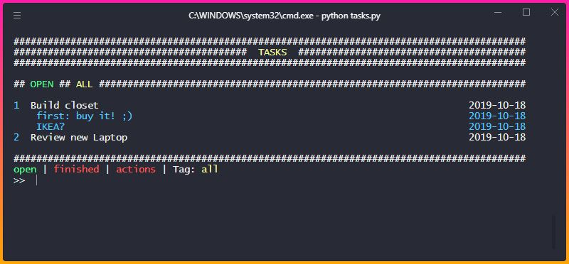

Possible actions:
+    "Add todo": "n text"
+    "Edit todo title": "e# text"
+    "Toggle comments": "c"
+    "Show comments of only one todo": "c#"
+    "Add comment": "c# text"
+    "Add tag": "t# \*tag"
+    "Show all todos with this tag" : "\*tag" 
+    "Remove todo": "r#"
+    "Finish todo with result": "f# text"
+    "Reopen todo": "o#"
+    "List all todos": "l"
+    "List finished todos": "lf"
+    "List all used tags": "lt"
+    "List actions": "a"
+    "Cancel": "y"
+    "Reset ALL": "resetall"
+    "Add key/value to todos.json": "addkey"
